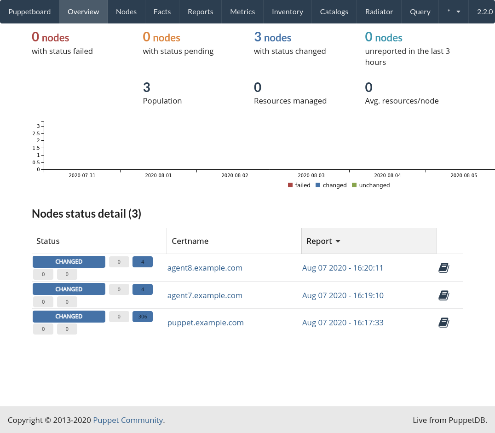

This is essentially a standard Puppet [control repo](https://github.com/puppetlabs/control-repo) with a Vagrant environment for testing against CentOS 7 and 8 while still being suitable to deploy with r10k. The test environment includes PuppetDB as well as [Puppetboard](https://github.com/voxpupuli/puppetboard). Built largely to help new Puppet users navigate the ecosystem, the Puppet Master bootstraps itself and only shell provisioning is used in Vagrant.

I have only tested extensively on Fedora 32.

# Starting Vagrant Environment

```
cd vagrant \
vagrant up puppet && vagrant up --no-parallel
```

This will be more reliable than simply running "vagrant up" because it ensures the puppet master is provisioned before the agents. Depending on your setup, you may be able to omit the --no-parallel but it's safest to include it.

# Accessing Puppetboard
If everything is working properly, Vagrant will expose puppetboard on [localhost:8080](http://localhost:8080/)

Initially, Puppetboard should look like this:


# Accessing Machines
Three virtual machines are created, puppet, agent7, and agent8.
```
cd vagrant \
vagrant ssh [machinename]
```

# NFS exports and firewalld

To make it easy to edit puppet manifests and have the changes immediately apply, we're using NFS to share with the Puppet Master. By default, firewalld may not guests to access NFS exports. The following command will make all traffic on the virtual interface used with guests trusted:

```
sudo firewall-cmd --permanent --add-service=nfs --zone=libvirt\
    && sudo firewall-cmd --permanent --add-service=rpc-bind --zone=libvirt \
    && sudo firewall-cmd --permanent --add-service=mountd --zone=libvirt \
    && sudo firewall-cmd --reload

```

Here is a [more complete explanation](https://developer.fedoraproject.org/tools/vagrant/vagrant-nfs.html) from the Fedora Project.

